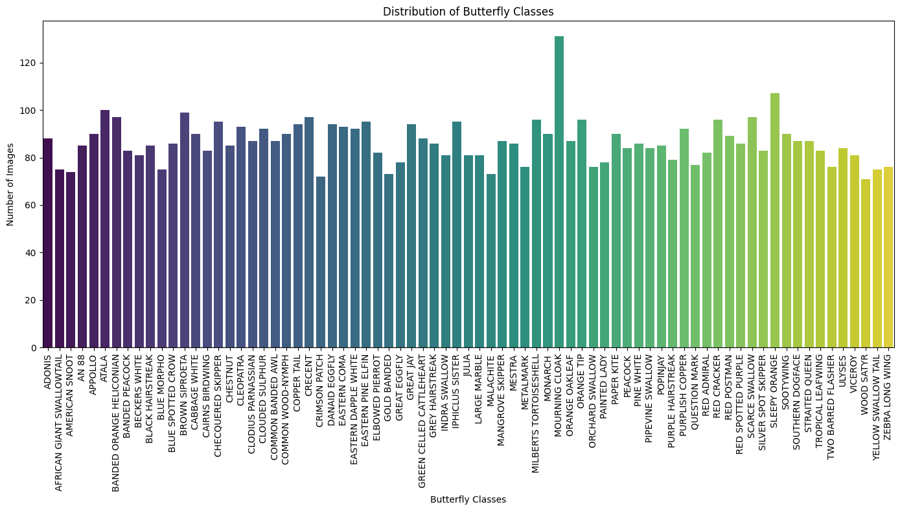
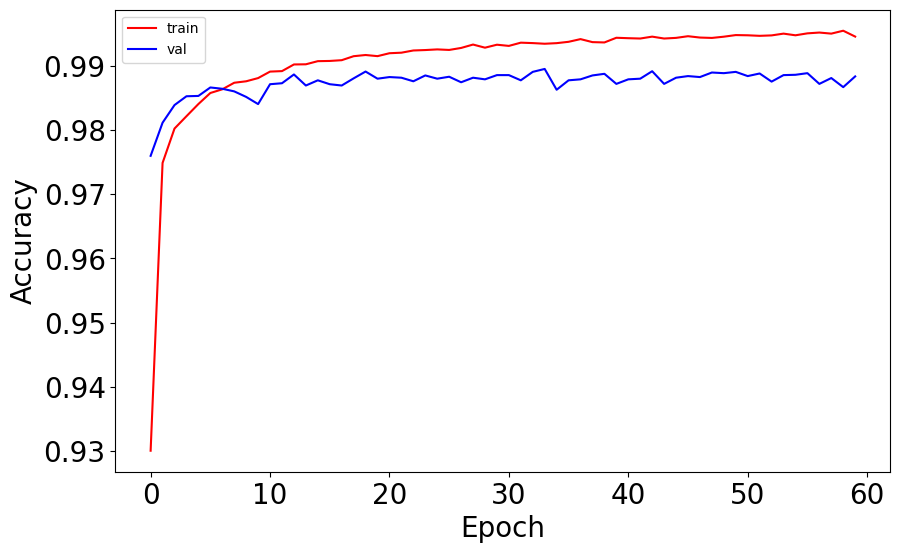
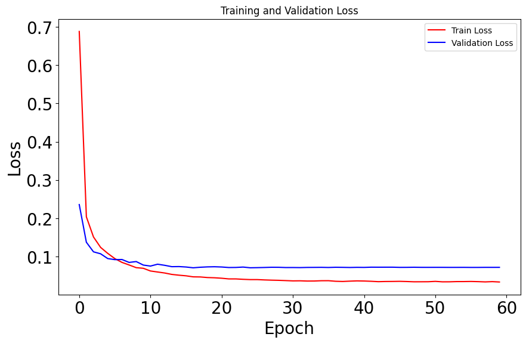

<a id="readme-top"></a>

<h1 align="center">Neural Network Classification Projects</h1>

<p align="center">
  A comprehensive deep learning repository featuring two distinct artificial neural network implementations: multi-class butterfly species classification and handwritten digit recognition (MNIST).
</p>

<p align="center">
  
  
  
  
</p>

<br>

## 📋 Table of Contents

- [Overview](#-overview)
- [Project Architecture & Key Features](#-project-architecture--key-features)
- [Repository Structure](#-repository-structure)
- [Getting Started](#-getting-started)
- [Midterm Project: Butterfly Image Classification](#-midterm-project-butterfly-image-classification)
  - [Dataset & Distribution](#dataset--distribution)
  - [Sample Visualizations](#sample-visualizations)
  - [Performance Benchmarks](#performance-benchmarks)
- [Final Project: MNIST Handwritten Digit Recognition](#-final-project-mnist-handwritten-digit-recognition)
  - [Model Architecture](#model-architecture)
  - [Training & Optimization Dynamics](#training--optimization-dynamics)
- [Comparative Summary & Evaluation](#-comparative-summary--evaluation)
- [License](#-license)

<br>

---

## 📌 Overview

This repository showcases the implementation and comparative analysis of Artificial Neural Networks (ANNs) built across two major milestones:

1. **Midterm Project**: Exploratory feature engineering, data distribution analysis, and ANN-based classification of multi-class butterfly images.
2. **Final Project**: End-to-end optimization, regularization (Dropout), and learning rate scheduling applied to multi-layer perceptrons (MLP) on the classic MNIST dataset.

The primary goal is to demonstrate a robust machine learning workflow—moving from exploratory data analysis and baseline architecture setup to hyperparameter tuning and performance evaluation.

<br>

---

## ✨ Project Architecture & Key Features

```text
               ┌──────────────────────────────────────────────┐
               │         Raw Data Input Pipeline              │
               └──────────────────────┬───────────────────────┘
                                      │
              ┌───────────────────────┴───────────────────────┐
              │                                               │
              ▼                                               ▼
  ┌───────────────────────┐                       ┌───────────────────────┐
  │ Midterm Pipeline      │                       │ Final Pipeline        │
  │ • Butterfly Image Sets│                       │ • MNIST Grayscale 28x28│
  │ • Class Imbalance Check│                      │ • Vector Normalization│
  │ • Fully Connected ANN │                       │ • Dropout Regularize  │
  └───────────┬───────────┘                       └───────────┬───────────┘
              │                                               │
              └───────────────────────┬───────────────────────┘
                                      │
                                      ▼
               ┌──────────────────────────────────────────────┐
               │    Evaluation: Loss, Accuracy & Metrics      │
               └──────────────────────────────────────────────┘
```

- **Modular Pipeline**: Flexible preprocessing stages for both image matrices and tabular feature vectors.
- **Custom Regularization**: Integrated Dropout layers and learning rate schedulers to mitigate overfitting.
- **Visual Analytics**: Direct visualization of dataset balances, sample images, and epoch-by-epoch loss/accuracy curves.

<br>

---

## 📂 Repository Structure

```text
.
├── annmidterm.ipynb                  # Midterm Project Notebook (Butterfly Classification)
├── annfinal.ipynb                    # Final Project Notebook (MNIST Digit Recognition)
├── static/
│   └── screenshots/                  # Project assets & visualizations
│       ├── distribution.png          # Butterfly class distribution plot
│       ├── samples.png               # Sample image grid
│       ├── loss-graph.png            # Loss trajectory plot
│       ├── accuracy-graph.png        # Accuracy progression plot
│       └── training-validation-loss-graph.png  # Train vs. Validation loss graph
├── README.md                         # Project documentation
└── LICENSE                           # License information
```

<br>

---

## 🚀 Getting Started

### Prerequisites

Ensure you have **Python 3.8+** installed along with Jupyter environment:

```bash
python --version
```

### Installation

1. **Clone the repository:**
   ```bash
   git clone https://github.com/alyn8/Neural-Network-Classification-Projects.git
   cd Neural-Network-Classification-Projects
   ```

2. **Install required dependencies:**
   ```bash
   pip install numpy pandas matplotlib scikit-learn tensorflow scikeras
   ```

3. **Launch Jupyter:**
   ```bash
   jupyter notebook
   ```

<br>

---

## 🦋 Midterm Project: Butterfly Image Classification

The midterm phase investigates multi-class classification on a butterfly image dataset, focusing on initial data exploration, class imbalance verification, and baseline ANN modeling.

### Dataset & Distribution

Understanding class distribution is crucial before model training. The chart below illustrates the sample counts across butterfly categories in the dataset:

<br>

<p align="center">
  
</p>

<p align="center">
  <i>Figure 1: Target class frequency and sample distribution analysis.</i>
</p>

<br>

### Sample Visualizations

Representative image samples from the dataset classes used during feature extraction:

<br>

<p align="center">
  
</p>

<p align="center">
  <i>Figure 2: Sample butterfly images across distinct dataset categories.</i>
</p>

<br>

### Performance Benchmarks

Below is a representative sample of model feature inputs and calculated prediction outputs:

| Sample Index | Feature $X_1$ | Feature $X_2$ | Feature $X_3$ | Target $X_4$ |
| :---: | :---: | :---: | :---: | :---: |
| **01** | 0.738 | 0.753 | 0.216 | **1.594** |
| **02** | 0.048 | 0.082 | 0.874 | **1.074** |
| **03** | 0.138 | 0.920 | 0.199 | **1.300** |
| **04** | 0.637 | 0.524 | 0.281 | **1.394** |
| **05** | 0.093 | 0.142 | 0.770 | **0.992** |

<br>

---

## 🔢 Final Project: MNIST Handwritten Digit Recognition

The final project advances the modeling paradigm to a Multi-Layer Perceptron (MLP) trained on $28 \times 28$ grayscale handwritten digit images (MNIST).

### Model Architecture

```text
   [Input Layer: 784 Units]
              │
              ▼
  [Dense Layer: 64 Neurons + ReLU]
              │
              ▼
     [Dropout Rate: 10%]
              │
              ▼
  [Dense Layer: 64 Neurons + ReLU]
              │
              ▼
  [Output Layer: 10 Neurons + Softmax]
```

- **Optimizer**: Stochastic Gradient Descent (SGD) with momentum ($0.8$)
- **Learning Rate**: $0.1$ with Exponential Decay Scheduler
- **Loss Function**: Categorical Crossentropy

<br>

### Training & Optimization Dynamics

The optimization progress over training epochs is shown in the figures below:

#### Loss Trajectory
<p align="center">
  
</p>

<p align="center">
  <i>Figure 3: Training loss convergence curve across 60 epochs.</i>
</p>

<br>

#### Accuracy Progression
<p align="center">
  
</p>

<p align="center">
  <i>Figure 4: Training vs. Validation accuracy growth trajectory.</i>
</p>

<br>

#### Training vs. Validation Loss Comparison
<p align="center">
  
</p>

<p align="center">
  <i>Figure 5: Detailed comparison between training and validation loss curves evaluating model generalization.</i>
</p>

<br>

---

## 📊 Comparative Summary & Evaluation

| Metric / Aspect | Midterm Project | Final Project |
| :--- | :--- | :--- |
| **Domain** | Butterfly Species Classification | MNIST Digit Recognition |
| **Input Type** | Multi-class Feature/Image Data | $28 \times 28$ Normalized Grayscale Vector (784) |
| **Architecture** | Baseline Fully Connected Network | Multi-Layer Perceptron (2 Hidden Layers) |
| **Regularization** | Standard Scaling | Dropout ($10\%$) + Exponential LR Decay |
| **Peak Accuracy** | Exploratory Evaluation | **~97.9% Test Accuracy** |

<br>

---

## 📜 License

Distributed under the **MIT License**. See [`LICENSE`](LICENSE) for more details.

<br>

<p align="right">(<a href="#readme-top">back to top ⇡</a>)</p>
